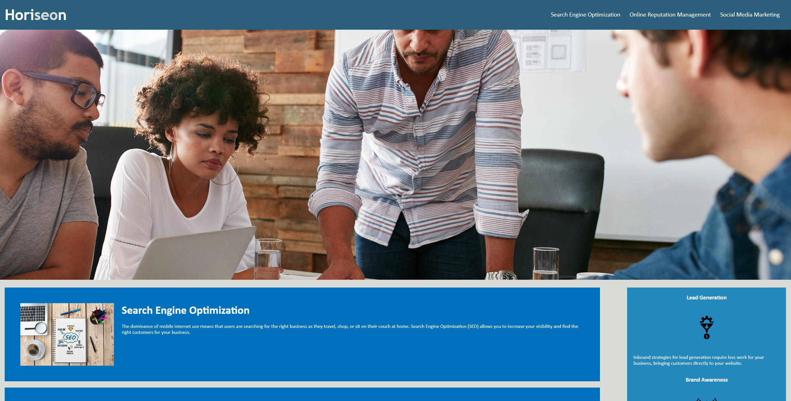
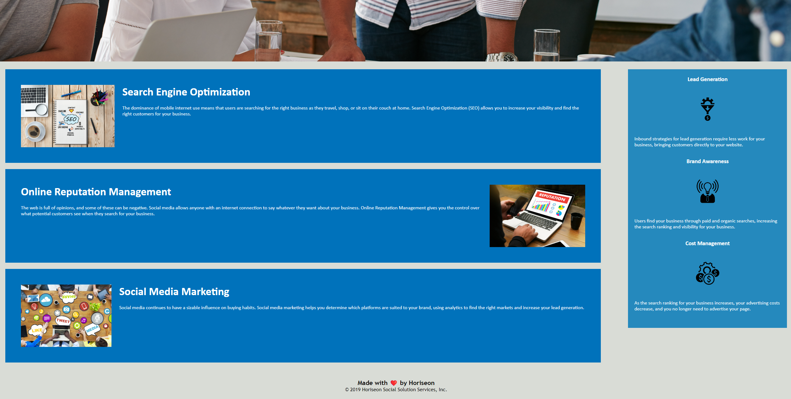

# Sam Ebadi Sobi

## Website live URL: [Search Engine Optimization](https://captaineb.github.io/URBAN-OCTO-TELEGRAM-SE-OPTIMIZED/)

Changed the website files to meet the acceptance criteria:
1. Added alt tags to all images.
2. Made the page more semantic by adding section, header, nav and footer tags.
3. Consolidated the style.css file content to be more readable and added comments where needed.
4. Changed the website title.

---

---
